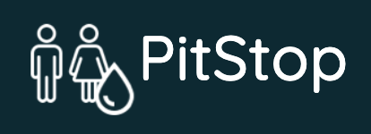
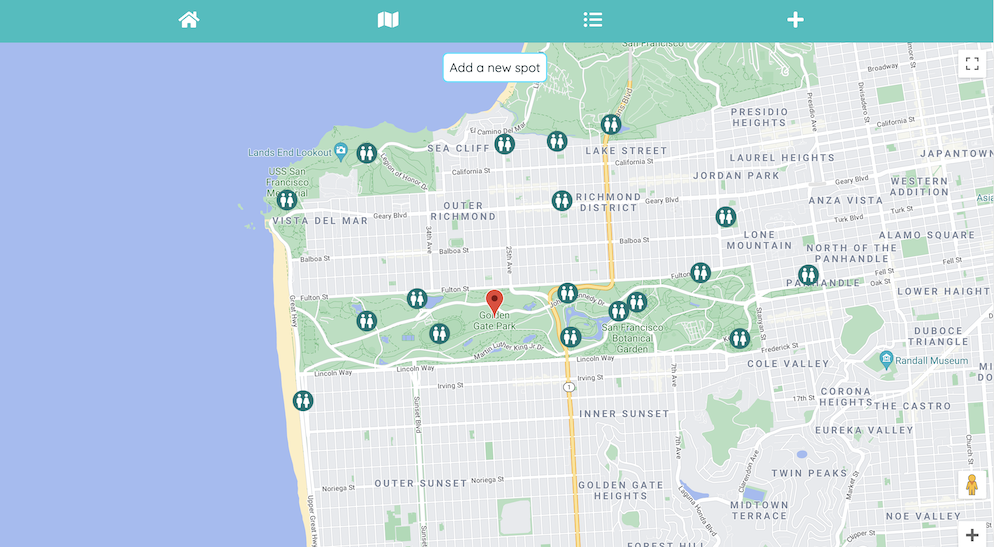
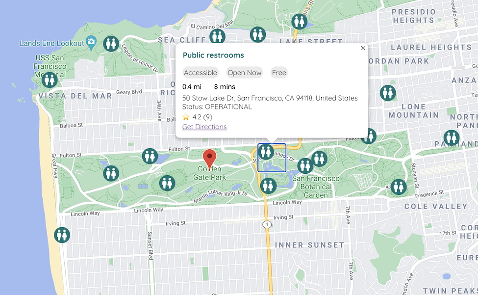

<!-- PROJECT LOGO -->
 

  

# PitStop

PitStop, a free water and toilet finder, will instantly show you all free and available restroom and drinking fountains near you. This mobile-friendly web-based app does not require any download to make it easy for you to find what you need when you need it. Simply enter your location, or allow search nearby to see the closest options near you. Help keep our database up-to-date by adding new resources or editing existing records. With this app, relief is only a click away.

**Created By <a href="https://github.com/chiakat">Katherine Yu</a>**

(<a href="#top">back to top</a>)

<!-- ABOUT THE PROJECT -->
## About The Project

  

PitStop is an MVP created during a 2-day solo sprint. I was challenged with ideating and developing a full-stack app of my choosing during the limited time frame. As an avid long-distance runner who frequently found myself struggling to find restrooms and water fountains during my 2+ hour runs, I created this app to provide an easy way to identify these key resources.

(<a href="#top">back to top</a>)

## App Features

<table>
  <tr>
    <td>
      
    </td>
    <td>
      <b>Search:</b>  Users can toggle between searching for toilets or water. They can either search nearby using their current location or enter a new location.
    </td>
  </tr>
  <tr>
    <td>
      
    </td>
    <td>
      <b>Map of Results:</b>  The 20 closest results are marked on the map. More results are populated as the user moves the map. Clicking on a specific marker will provide more detail about the location.
    </td>
  </tr>
  <tr>
    <td>
      
    </td>
    <td>
      <b>Location Details:</b>  Clicking on a specific map marker will open an info window with more details about the location including distance from the user's location, time to the location by walking, whether the location is open, accessible, or free, user ratings, and step-by-step directions via Google Maps.
    </td>
  </tr>
  <tr>
    <td>
      
    </td>
    <td>
      <b>List of Results:</b>  Users can toggle between the map and the list, which will show all the locations and details about each location in list view.
    </td>
  </tr>
  <tr>
    <td>
      
    </td>
    <td>
      <b>Add More Locations:</b>  Users can contribute to the map by entering new toilets and drinking fountains. They can mark the specific location on the map and enter more details about the location to help other users. Additional details include whether the location is public/private, requires a key, has unisex rooms, changing tables, soap and/or toilet paper.
    </td>
  </tr>
</table>

(<a href="#top">back to top</a>)

### Built With

* [React.js](https://reactjs.org/)
* [Express.js](https://expressjs.com/)
* [SQLite](https://www.sqlite.org/)
* [Google Maps Platform](https://mapsplatform.google.com/)

(<a href="#top">back to top</a>)

## Getting Started
First install dependencies:
npm install

To create a development build:
npm run react-dev

To start server:
npm run start

Launch site:
http://localhost:3030
